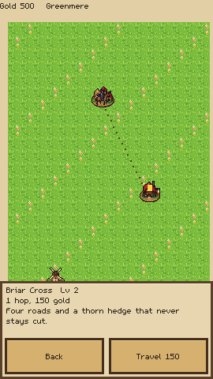
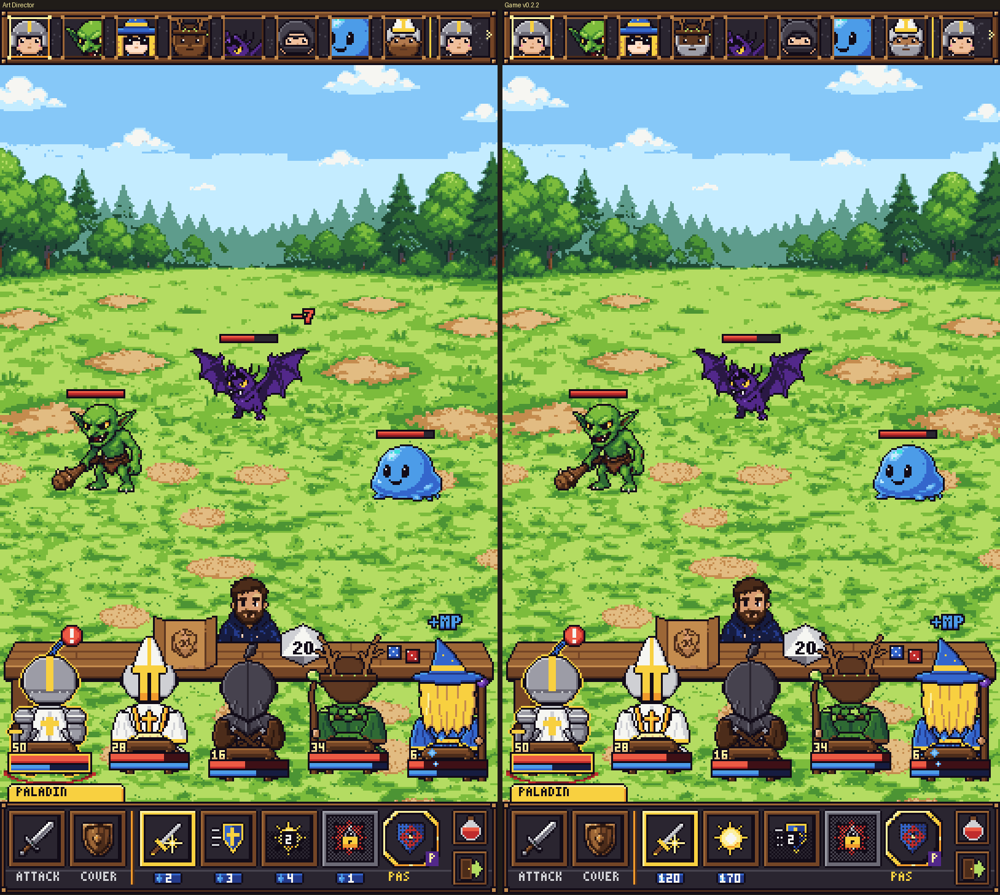
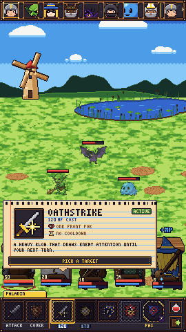
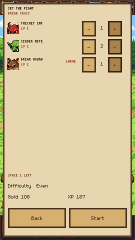
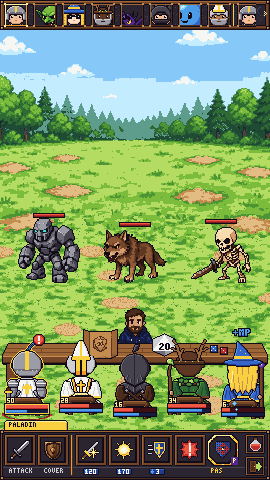
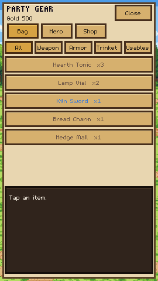
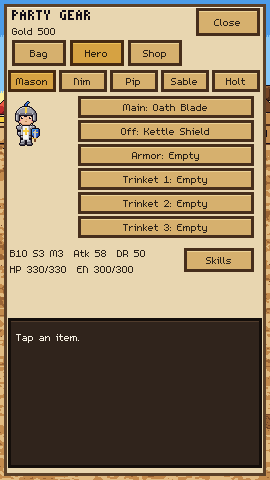
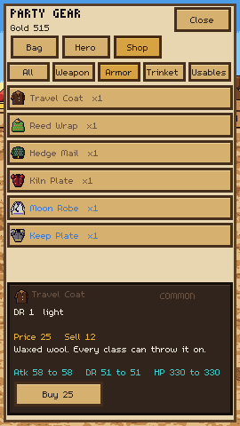
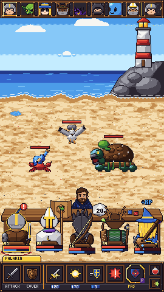
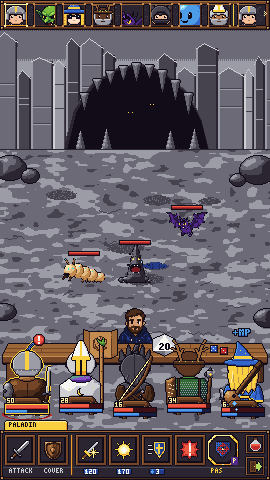

# Paladins of Pen and Paper

A portrait, tabletop-framed pixel RPG. Phase 0 is a playable phone slice: recruit one to five heroes, walk a vertical region map, and fight at the table.

The native viewport is **270×480**, integer-scaled with nearest-neighbor filtering. Screen positions live in [`data/layout.json`](data/layout.json). A `landscape` block is reserved there so a desktop layout can be added later without rewriting the screens. Production sprites live in [`art_source/phase0`](art_source/phase0) and are loaded by [`scripts/core/art_pack.gd`](scripts/core/art_pack.gd). The UI font is [m5x7](https://managore.itch.io/m5x7) by Daniel Linssen, CC0, at size 16 so it sits on the native grid.

Names, dialogue, and art in this repository are original. Combat math and the timing table follow the project's design breakdown.

## Play

Godot **4.7** or newer.

```bash
godot --path .
```

On a phone the window is portrait. On desktop the window opens at 810×1440, which is exactly three times the native grid.

1. **New game** seats one to five heroes. Eight classes are on the Class tab: Paladin, Wizard, Ranger, Bard, Cleric, Rogue, Barbarian, and Druid. Each persona and each class can be used only once. There are five personas, so a full party can still keep them unique. Random fills the paper doll; the arrows and the rows under it edit the current tab. Next seats this hero and opens another slot. Begin starts the campaign with the heroes seated so far, including the one on screen.
2. The table hub has Travel, Fight, Rest, Quest, and Gear along the bottom. Gear opens the shared bag: All, Weapons, Armor, Trinkets, and Usables, then a card with the name, rarity, stats, price, and Equip, Use, or Sell. Hero shows main hand, off hand, armor, and three trinkets. A two-handed weapon takes both hands. Heavy armor and weapon tags follow the class. Shop appears in a town and sells for half. Candlewick is a town, so Fight stays off there. Everywhere else, Fight opens a builder for that place's region: meadow at Millpond and Briar Cross, coast at Lantern Reach, cave at Howling Cleft, and keep at Gravel Keep. Each foe is regular or large. The table holds 15 space: a regular foe costs 3 and a large foe costs 5, so five regulars or three larges fill it. One large plus three regulars, or two larges plus one regular, fit as well. The builder shows the space left and will not add a foe that overflows. Large foes take a wider spot on the enemy row. Start fights that lineup. The last lineup is remembered at that place. Road ambushes draw from the same place table. Expected gold and XP follow the battle formulas. A direct heal changes the chair's health the moment it is cast. Health that returns at the start of a turn is labeled on the skill card.
3. **Travel** opens the Greenmere map. Drag to scroll. Tap a place, then tap it again or press Travel. Stop ends a multi-hop trip after the hop you are already on. Bag on the top bar opens the same inventory. It hides while the pawn is walking.
4. Roads with monsters roll a d20 around the middle of the hop. 1 is lost, 2 through p is an ambush, p+1 through 19 is safe, 20 is lucky. `p = clamp(destination level − party average + 7, 2, 10)`.
5. Combat is stacked for one hand: a wooden initiative strip for up to eight combatants, monsters in the meadow, the GM behind the table with his screen and dice, and up to five heroes seated at the table edge with HP and MP bars on the chair. Equipped weapon and armor show as a small mark on the seat doll. The acting hero's bar is Attack, Cover, the class's five skills, Item, and Run. Item opens the usables in the pouch; tap one, then tap an ally. Using it ends the turn, and a heal updates the chair immediately. Tapping an enemy on that hero's turn is a basic attack. A skill that needs one foe or one ally shows its card and highlights the valid targets; tap one to cast. Tap that skill again, tap another skill, or tap empty ground to cancel. Skills that choose their own targets (self, every foe) still open the card on the first tap and cast on the second. The Attack button can still open pick-a-target. A passive, a locked skill, a cooling skill, and a skill you cannot pay for show the reason and cannot be armed. The name tab above the bar is whose turn it is. Passives also show in the creator and on the party panel with a Passive tag.

The save is `user://paladins_save.json`. It is written when the app pauses or closes. A fight in progress reloads from the checkpoint taken when the battle started, so a kill during the fight does not keep half-applied rewards.

## Checks

```bash
godot --headless --path . -s res://tests/run_tests.gd
bash tools/check_export.sh
```

The first command covers the stat, HP, energy, damage, crit, XP, gold, travel-table, dice, timing, path, portrait-layout, party seats, skill-button states, the arm-then-cast inspect card, cooldown, HP-cost, build-up, mana regen, threat raffle, and on-hit passive examples. It runs against the project directory.

`tools/check_export.sh` exports a PCK and runs that pack from an empty directory. `--export-check` requires the map to spawn more than 0 place nodes, and the grass, combat backdrop, skill icon, seat doll, creator doll, UI icon, and tap sound must load. `--touch-check` then injects `InputEventScreenTouch` press and release (with mouse emulation off) into the title, creator, hub, map, and combat action bar. A map tap selects a place; the second tap walks the pawn. That is the check that matches an APK.

The older files under `art/` are still generated with `python3 tools/gen_art.py` and stay in the repo for the title backdrop and the file checks. The creator, map, and combat screens use the production pack.

## Screenshots

Native 270×480 captures of the production art:
























## Android

[`export_presets.cfg`](export_presets.cfg) has a debug Android preset locked to portrait (`screen/orientation=1`) and arm64-v8a, plus a Linux preset. The project setting `display/window/handheld/orientation` is portrait.

```bash
godot --headless --export-debug Android build/paladins-0.3.5-debug.apk
```

The export needs the Godot 4.7.2 Android templates (installed into `android/build`, which is gitignored), a `.build_version` of `4.7.2.stable`, Android SDK 36, build-tools 36.1.0, NDK 29.0.14206865, and a JDK. The project enables ETC2/ASTC import, which the Android exporter requires. Non-resource files (`*.json`, `*.md`) are in the preset include filter. Art is loaded with `load()` / `ResourceLoader`, not `FileAccess.file_exists` on the raw PNG.

The published debug APK is [v0.3.5](https://github.com/thegliffy/paladins-of-pen-and-paper/releases/tag/v0.3.5): [paladins-0.3.5-debug.apk](https://github.com/thegliffy/paladins-of-pen-and-paper/releases/download/v0.3.5/paladins-0.3.5-debug.apk). It is arm64-v8a, portrait, package `com.thegliffy.paladinspenpaper`, version code 17. v0.3.5 adds Brinewick, Ashgate, and Pebblegate, a tiered stall in each town, and a smith that crafts and tempers gear. v0.3.4 puts the hub place name and location blurb on opaque parchment so they read on the clouds. v0.3.3 keeps the quest log, notice board, and map tracker on an opaque parchment panel, wraps their text inside that panel, and fits the hub button words. v0.3.2 adds a story chain from Candlewick to Gravel Keep and a Candlewick notice board of repeatable kill and drop quests. Accepting a notice rerolls that slot. v0.3.1 swaps in the weapon-less class layer whenever a main-hand weapon is worn, so paladin, druid, wizard, barbarian, bard, and ranger do not draw a second weapon. Cleric and rogue keep their normal layers. v0.3.0 uses the approved item icons and seats gear in the paper-doll recipe: armor under the hair, weapons over the hat, and the chair last. v0.2.9 paints each place's combat backdrop and fills the meadow, coast, cave, and keep with their own monsters. v0.2.8 adds the shared bag, hero equipment, town shop, class starting kits, and monster drops. v0.2.7 applies a direct heal the moment it is cast, gives each place its own monster table, and names a combat backdrop per place. v0.2.6 sizes the fight: five regular foes or three large ones, with mixed lineups spending a shared table of 15 space. v0.2.5 taps an enemy to attack, aims single-target skills by tapping the table, and opens a fight builder. v0.2.4, v0.2.3, v0.2.2, v0.2.1, v0.2.0, and v0.1.0 are left as-is.

## Where numbers live

| Data | File |
| --- | --- |
| Personas, races, classes, skills, monsters, items, story and board quests | `data/*.json` |
| Class roles, passives, and the threat raffle | [`docs/CLASSES.md`](docs/CLASSES.md), [`docs/DESIGN.md`](docs/DESIGN.md) |
| Threat coefficients | [`data/threat.json`](data/threat.json) |
| Places, roads, levels | `data/region.json` |
| Encounter difficulties | `data/encounters.json` |
| Paper-doll colors and layer counts | `data/appearance.json` |
| Screen rectangles | `data/layout.json` |
| Formulas | `scripts/core/formulas.gd` |
| Delays | `scripts/core/timing.gd` |

A level 1 hero is `class + persona + race + 2` on Body, Senses, and Mind. HP is `15 × (L × Body − L + Body + Mind)`. Energy is `20 × (L × Mind − L + Body + Mind)` plus any race bonus. The next level costs `L² × 30 + 30` XP.

## Deviations from the breakdown

- **Portrait.** The playable slice is 270×480, not a landscape 480×270 table. The same staging is stacked: monsters on top, GM and table in the middle, up to five heroes below with bars on the chairs, then the acting hero's bar in thumb reach.
- **Lost** on the road starts an ambush. There is no secret-list yet, so a lost result cannot award one.
- A **natural 20** awards free travel or a Hearth Tonic. It does not pull from a secret list.
- Sable's travel bonus is added to the d20 and the total is clamped to 1–20 before the table is read. A raw 1 with that bonus becomes 2.
- **Gold** is summed per monster (including the 20% chance of bonus gold), then passed through the battle multiplier. The level gap is the party average minus the monster's level, and it does not go below 0.
- The party shares one pouch of 40 item stacks. A town sells from that catalog, and selling returns half the price, rounded down. Each class starts with a weapon, and some start with an off-hand piece, already worn.
- **Stun** uses the table's two-tick timer.
- The **chicken** runs left and up across the portrait table for 1.8 s. The sound plays at 1.1 s.
- You start with **500 gold**, three Hearth Tonics, and two Lamp Vials.
- Level 1 monsters use the level-1 HP exception (the formula divided by 3), so the pond fight is short.
- Skill ranks use the energy-cost formula on **mana** skills only. Cooldowns, free actions, HP costs, and build-up tracks (Rogue combo, Bard tempo, Barbarian rage) do not go through that formula. Damage and healing add a small per-rank term. There is no separate power-curve table yet.
- Each class has one passive besides its actives. Monsters raffle a living member by threat. Threat is class base plus Body and a little of damage reduction, then taunt and a passive multiplier, and it never drops below 1. Cover halves it. The Wizard regains a share of max energy at the start of each of their turns. Other passives cover crits, healing, initiative, a party damage-reduction aura, health regen, a flat on-hit cut, and damage that rises as health falls. Set `debug` in `data/threat.json` to show each member's threat percent on their chair.
- Monster pictures use the production pack. The first eight were renamed to match the sprites: Blueslime, Crimson Imp, Thorn Gob, Briar Wolf, Orangecap, Reedbones, Duskbat, and Cairn Golem. Meadow adds Bramblet and Grinmud Toad. The coast adds Bottlecrab, Squallgull, and Kelpback Snapper. The cave adds Gloomgrub and Dripfang. The keep adds Pebble Squire, Hollow Helm, and Cobble Rat. Map nodes use the village, windmill, tavern, shrine, cave, and castle pictures. Each place has a 270×480 backdrop with the horizon at y141. Candlewick's backdrop is there, and the town still has no fight.
- No terrain effects, so the 1.5 s terrain intro does not play.
- No counter-attack skills. The counter delays are still in the timing constants and the tests.
- The bard's second skill applies **poison**, not weakness.
- A wild rest that fails every Senses die is interrupted by an ambush and does not heal first.
- A wipe revives the party to about a quarter of their health and charges the resurrect cost when the purse can pay, so the slice cannot soft-lock.
- Audio is generated tones. There is no music.
- Combat, the creator, and the map use the production sprite pack. The title screen still uses the meadow backdrop from `art/`.

A basic attack's waits are 0.25 s wind-up, 0.20 s to the hit, and a 0.50 s HP tween (0.95 s). Punch and the red blink run inside that tween. On the machine that captured the screenshots, one measured attack completed in 805 ms, inside the 0.8–1.2 s gate.

The area outside the 270×480 viewport (the letterbox on a taller phone) clears to the canvas color `#1f140d`.
