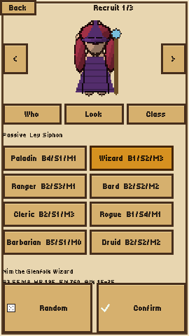
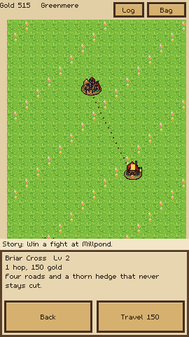
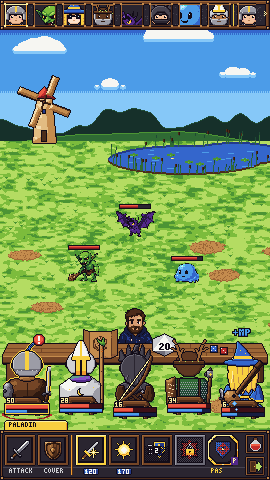
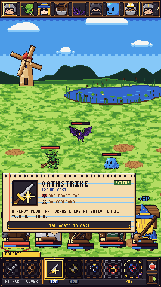
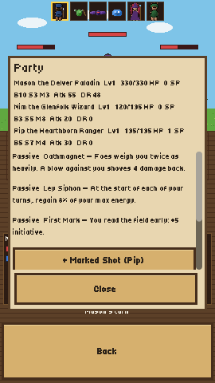

# Paladins of Pen and Paper

A portrait, tabletop-framed pixel RPG. Phase 0 is a playable phone slice: recruit three heroes, walk a vertical region map, and fight at the table.

The native viewport is **270×480**, integer-scaled with nearest-neighbor filtering. Screen positions live in [`data/layout.json`](data/layout.json). A `landscape` block is reserved there so a desktop layout can be added later without rewriting the screens. Sprite paths and doll anchors live in [`scripts/core/sprite_catalog.gd`](scripts/core/sprite_catalog.gd).

Names, dialogue, and art in this repository are original. Combat math and the timing table follow the project's design breakdown.

## Play

Godot **4.7** or newer.

```bash
godot --path .
```

On a phone the window is portrait. On desktop the window opens at 810×1440, which is exactly three times the native grid.

1. **New game** seats three heroes. Eight classes are on the Class tab: Paladin, Wizard, Ranger, Bard, Cleric, Rogue, Barbarian, and Druid. Each persona and each class can be used only once. Random fills the paper doll; the arrows and the rows under it edit the current tab. Confirm is in the bottom thumb row.
2. The table hub has Travel, Fight, Rest, Quest, and Party along the bottom.
3. **Travel** opens the Greenmere map. Drag to scroll. Tap a place, then tap it again or press Travel. Stop ends a multi-hop trip after the hop you are already on.
4. Roads with monsters roll a d20 around the middle of the hop. 1 is lost, 2 through p is an ambush, p+1 through 19 is safe, 20 is lucky. `p = clamp(destination level − party average + 7, 2, 10)`.
5. Combat is stacked for one hand: initiative, monsters, the GM behind the table, the party from behind, HP/MP cards, then Attack, Skill, Item, Cover, and Run. Skill opens that class's active skills only. Each button shows the cost or the cooldown, and a skill you cannot pay for is grey. Passives are always on. They show in the creator and on the party panel with a Passive tag.

The save is `user://paladins_save.json`. It is written when the app pauses or closes. A fight in progress reloads from the checkpoint taken when the battle started, so a kill during the fight does not keep half-applied rewards.

## Checks

```bash
godot --headless --path . -s res://tests/run_tests.gd
```

That covers the stat, HP, energy, damage, crit, XP, gold, travel-table, dice, timing, path, portrait-layout, cooldown, HP-cost, build-up, mana regen, threat weighting, and on-hit passive examples.

Placeholder art is generated with `python3 tools/gen_art.py`.

## Screenshots

Native 270×480 captures:











## Android

[`export_presets.cfg`](export_presets.cfg) has a debug Android preset locked to portrait (`screen/orientation=1`) and arm64-v8a, plus a Linux preset. The project setting `display/window/handheld/orientation` is portrait.

```bash
godot --headless --export-debug Android build/paladins-0.1.0-debug.apk
```

The export needs the Godot 4.7.2 Android templates (installed into `android/build`, which is gitignored), a `.build_version` of `4.7.2.stable`, Android SDK 36, build-tools 36.1.0, NDK 29.0.14206865, and a JDK. The project enables ETC2/ASTC import, which the Android exporter requires.

The published debug APK is [v0.1.0](https://github.com/thegliffy/paladins-of-pen-and-paper/releases/tag/v0.1.0): [paladins-0.1.0-debug.apk](https://github.com/thegliffy/paladins-of-pen-and-paper/releases/download/v0.1.0/paladins-0.1.0-debug.apk). It is arm64-v8a, portrait, package `com.thegliffy.paladinspenpaper`. That build is the portrait slice from before the eight-class skill list. Export again with the command above to include Cleric, Rogue, Barbarian, Druid, and the mixed skill costs.

## Where numbers live

| Data | File |
| --- | --- |
| Personas, races, classes, skills, monsters, items, the quest | `data/*.json` |
| Class roles and the 32 skills | [`docs/CLASSES.md`](docs/CLASSES.md) |
| Places, roads, levels | `data/region.json` |
| Encounter difficulties | `data/encounters.json` |
| Paper-doll colors and layer counts | `data/appearance.json` |
| Screen rectangles | `data/layout.json` |
| Formulas | `scripts/core/formulas.gd` |
| Delays | `scripts/core/timing.gd` |

A level 1 hero is `class + persona + race + 2` on Body, Senses, and Mind. HP is `15 × (L × Body − L + Body + Mind)`. Energy is `20 × (L × Mind − L + Body + Mind)` plus any race bonus. The next level costs `L² × 30 + 30` XP.

## Deviations from the breakdown

- **Portrait.** The playable slice is 270×480, not a landscape 480×270 table. The same staging is stacked: monsters on top, GM and table in the middle, party below, cards, then the five actions in thumb reach.
- **Lost** on the road starts an ambush. There is no secret-list yet, so a lost result cannot award one.
- A **natural 20** awards free travel or a Hearth Tonic. It does not pull from a secret list.
- Sable's travel bonus is added to the d20 and the total is clamped to 1–20 before the table is read. A raw 1 with that bonus becomes 2.
- **Gold** is summed per monster (including the 20% chance of bonus gold), then passed through the battle multiplier. The level gap is the party average minus the monster's level, and it does not go below 0.
- The party shares one pouch. There is no shop.
- **Stun** uses the table's two-tick timer.
- The **chicken** runs left and up across the portrait table for 1.8 s. The sound plays at 1.1 s.
- You start with **500 gold**, three Hearth Tonics, and two Lamp Vials.
- Level 1 monsters use the level-1 HP exception (the formula divided by 3), so the pond fight is short.
- Skill ranks use the energy-cost formula on **mana** skills only. Cooldowns, free actions, HP costs, and build-up tracks (Rogue combo, Bard tempo, Barbarian rage) do not go through that formula. Damage and healing add a small per-rank term. There is no separate power-curve table yet.
- Each class has one passive besides its actives. Monster targeting is still Body plus threat, then a threat multiplier from the Paladin and the Barbarian. The Wizard regains a share of max energy at the start of each of their turns. Other passives cover crits, healing, initiative, a party damage-reduction aura, health regen, a flat on-hit cut, and damage that rises as health falls.
- Cleric, Rogue, Barbarian, and Druid outfits are placeholder pixels until production sprites arrive.
- No terrain effects, so the 1.5 s terrain intro does not play.
- No counter-attack skills. The counter delays are still in the timing constants and the tests.
- The bard's second skill applies **poison**, not weakness.
- A wild rest that fails every Senses die is interrupted by an ambush and does not heal first.
- A wipe revives the party to about a quarter of their health and charges the resurrect cost when the purse can pay, so the slice cannot soft-lock.
- Audio is generated tones. There is no music.
- Art is placeholder pixel work. Production sprites can replace the files named in `SpriteCatalog` without moving anchors.

A basic attack's waits are 0.25 s wind-up, 0.20 s to the hit, and a 0.50 s HP tween (0.95 s). Punch and the red blink run inside that tween. On the machine that captured the screenshots, one measured attack completed in 818 ms, inside the 0.8–1.2 s gate.
